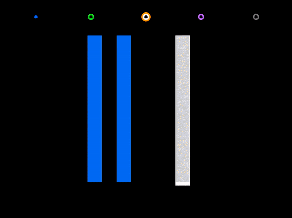

# Space Opera

Ludum Dare 42 Submission

The crowds want to hear the magic that you can bring to their ears. Compose as precisely as possible - no crotchet or quaver can go to waste.

## Build

1. Activate Emscripten
2. Build [`libraylib.bc`](https://github.com/raysan5/raylib/wiki/Working-for-Web-(HTML5)) and extract to `./lib`
3. `make assets -B && make watch`
4. Open http://localhost:8000
